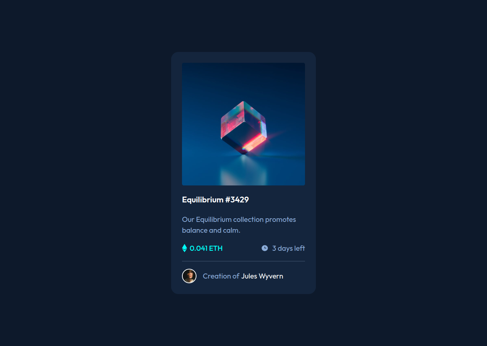

# Frontend Mentor - NFT preview card component solution

This is a solution to the [NFT preview card component challenge on Frontend Mentor](https://www.frontendmentor.io/challenges/nft-preview-card-component-SbdUL_w0U). Frontend Mentor challenges help you improve your coding skills by building realistic projects.

## Table of contents

- [Overview](#overview)
  - [The challenge](#the-challenge)
  - [Screenshot](#screenshot)
  - [Links](#links)
- [My process](#my-process)
  - [Built with](#built-with)
  - [What I learned](#what-i-learned)
  - [Continued development](#continued-development)
  - [Useful resources](#useful-resources)
- [Author](#author)
- [Acknowledgments](#acknowledgments)

## Overview

### The challenge

Users should be able to:

- View the optimal layout depending on their device's screen size
- See hover states for interactive elements

### Screenshot



### Links

- Solution URL: [GitHub Solution](https://github.com/Ehsan-Yari/NFT-preview-card-component)
- Live Site URL: [Live Preview](https://nft-preview-card-component-two-orpin.vercel.app/)

## My process

### Built with

- ViteJS
- TailwindCSS
- Mobile-first workflow

### What I learned

In this project, I had the opportunity to experiment with ViteJS and TailwindCSS. The biggest takeaway was understanding how ViteJS speeds up the development process with its hot module replacement and efficient bundling. TailwindCSS allowed me to quickly style the card with utility classes, making it easy to customize the design.

```html
<div class="max-w-xs mx-auto bg-white rounded-lg shadow-lg overflow-hidden">
  
</div>
```

### Continued development

In future projects, I want to focus on improving accessibility features like adding `aria` roles and optimizing for screen readers. I also want to get better at using advanced features of TailwindCSS, such as customizing themes and working with variants.

### Useful resources

- [ViteJS Documentation](https://vitejs.dev/) - I found this resource very helpful in getting started with ViteJS.
- [TailwindCSS Documentation](https://tailwindcss.com/docs) - TailwindCSS was a great tool for this project, and their documentation is super easy to follow.

## Author

- Website - [Ehsan Yari](https://ehsanyari.netlify.app/)
- Frontend Mentor - [@Ehsan-Yari](https://www.frontendmentor.io/profile/Ehsan-Yari)
- LinkedIn - [Ehsan Yari](https://www.linkedin.com/in/ehsan-yari-bb3b92228)

## Acknowledgments

I would like to thank the Frontend Mentor community for the great challenge and resources. It was a great learning experience.